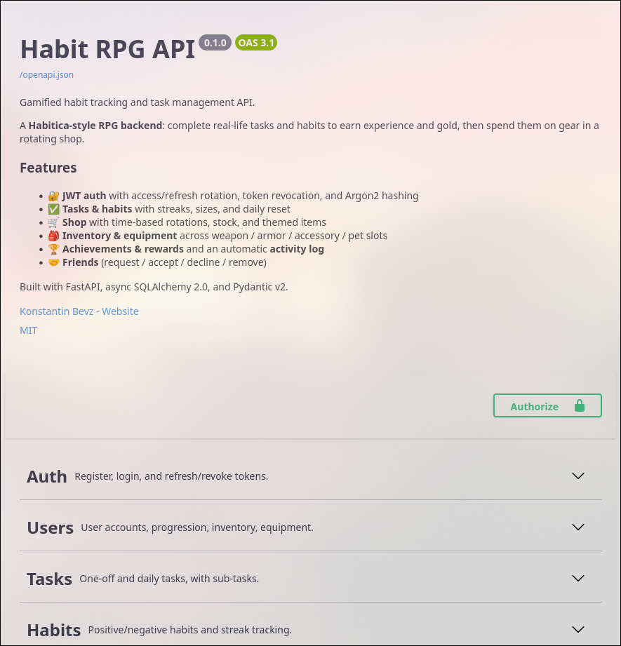
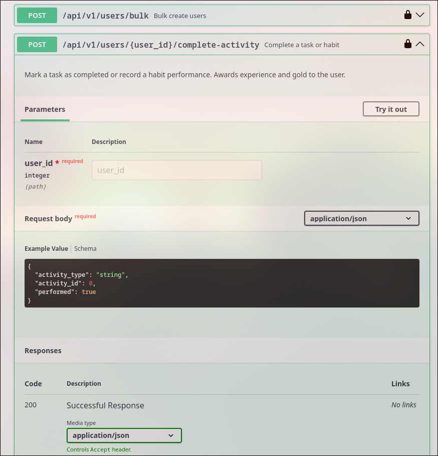

# ⚔️ Habit RPG API

[](https://github.com/koskrub-15/habit-rpg-api/actions/workflows/ci.yml)
[](https://codecov.io/gh/koskrub-15/habit-rpg-api)

A gamified habit tracking and task management API built with FastAPI. Transform your daily routine into an RPG adventure!



> Interactive API docs (Swagger UI) are served at `/docs` — every endpoint is
> documented, grouped, and try-it-out ready.

---

## 🚀 Overview

**Habit RPG API** is a robust backend service designed to help users build better habits and manage tasks through gamification. Earn gold, gain experience, unlock achievements, and equip items by completing your real-life goals.

### ✨ Key Features

- **🔐 Secure Authentication**: JWT-based auth with Access/Refresh token rotation and Argon2 password hashing.
- **🛒 Dynamic Shop**: Automated shop rotation, stock management, and time-based item availability.
- **🏆 Achievement System**: Automated and manual achievement unlocking based on user progress and streaks.
- **🤝 Social Integration**: Friend request system (send, accept, decline, remove).
- **📜 Activity History**: Automatic logging of every important action (tasks, habits, purchases).
- **🔄 Daily Reset**: Automated resetting of daily tasks and habits to keep your routine fresh.
- **🛠️ Generic Router Factory**: High-speed development with a custom factory for CRUD operations.

### 🛠️ Tech Stack

- **Framework**: [FastAPI](https://fastapi.tiangolo.com/)
- **Database**: PostgreSQL with [SQLAlchemy](https://www.sqlalchemy.org/) (Async)
- **Migrations**: [Alembic](https://alembic.sqlalchemy.org/)
- **Validation**: [Pydantic V2](https://docs.pydantic.dev/)
- **Environment**: [uv](https://github.com/astral-sh/uv) & [Docker](https://www.docker.com/)

---

## 🎬 API in action

A full loop — register, log in, create a habit, complete it, and earn rewards:

```bash
BASE=http://localhost:8000/api/v1

# 1. Register an account
curl -X POST $BASE/auth/register \
  -H "Content-Type: application/json" \
  -d '{"name": "Demo Hero", "email": "demo@habit.rpg", "password": "demo12345"}'

# 2. Log in and capture the access token
TOKEN=$(curl -s -X POST $BASE/auth/login \
  -d "username=demo@habit.rpg&password=demo12345" | jq -r .access_token)

# 3. Create a habit (user_id is resolved from the token)
curl -X POST $BASE/habits/ \
  -H "Authorization: Bearer $TOKEN" -H "Content-Type: application/json" \
  -d '{"name": "Read 30 minutes", "habit_type": "POSITIVE", "habit_size": "MEDIUM"}'
# → response includes the new habit "id" (e.g. 1)

# 4. Complete it — earn experience and gold (user_id 1, habit_id 1)
curl -X POST $BASE/users/1/complete-activity \
  -H "Authorization: Bearer $TOKEN" -H "Content-Type: application/json" \
  -d '{"activity_type": "habit", "activity_id": 1, "performed": true}'
```

Step 4 returns the reward the user just earned (exact amounts scale with habit size):

```json
{
  "activity_type": "Habit",
  "activity_name": "Read 30 minutes",
  "exp_gained": 20,
  "gold_gained": 10,
  "health_change": 0,
  "new_level": 1,
  "current_health": 100,
  "streak": "1"
}
```

Every protected endpoint is self-documenting in Swagger, with schemas and examples:



---

## 🏗️ Architecture highlights

Two custom abstractions keep the codebase small and consistent — most resources
are wired up in a handful of lines:

- **`RouterFactory`** — one call generates the 8 standard CRUD endpoints
  (create, list, count, get, update, delete, exists, bulk) for a resource. It
  inspects the response schema and automatically `selectinload`s nested
  relations, so adding a related object to a response is all it takes to load it.
- **`BaseCRUD[Model, Create, Update]`** — a generic, fully typed data-access
  layer (`create` / `get` / `get_multi` / `update` / `delete` / `count` /
  `bulk_create` / `get_or_create`) with pagination, filtering, LIKE search, and
  sorting. Override a single method to add domain logic (e.g. awarding rewards).

Request flow: `HTTP → endpoint → CRUD → SQLAlchemy → DB`.

See [CLAUDE.md](CLAUDE.md) for a deeper tour of the architecture.

---

## ⚡ Quick Start

> `just` is a convenience wrapper. If you don't have it installed, use the plain
> `uv` / `docker compose` commands below — they do the same thing.

### 🐍 Plain commands (no `just`)

```bash
# 1. Configure environment
cp .env.example .env          # then edit SECRET_KEY / DATABASE_URL

# 2a. Run locally with uv (SQLite or your own Postgres via DATABASE_URL)
uv sync
uv run uvicorn apps.main:app --reload   # → http://localhost:8000/docs

# 2b. ...or run the full stack (app + PostgreSQL) with Docker
cp compose.override.dev.yaml compose.override.yaml
docker compose up --build
```

Health check: `GET http://localhost:8000/health` · Swagger UI: `http://localhost:8000/docs`

### 🏃 With `just`

Build and run everything from zero, including configuration and database setup:

```shell
just app-i-docker-i-run      # bring it all up
just app-i-docker-i-purge    # wipe all data and start clean
```

---

## 🛠️ Development

### Install just

You must have [just] installed on your system to run different commands.

- [just.just](just/dev/just.just)

After installing [just], you can see all available commands with:

```bash
just --list
```

[just]: https://github.com/casey/just

### Initialize development environment

Create venv, register pre-commit hooks, and install dependencies:

```bash
just init-i-dev

# or, without just:
uv sync
uv run pre-commit install
```

### Run Tests

```bash
just test-i-run

# or, without just:
uv run pytest tests/ -v
```

---

## 🐳 Docker

Use services via Docker Compose.

### ▶️ Run

```shell
just d-run
```

### 🚮 Purge

Purge all data related to services:

```shell
just d-purge
```
